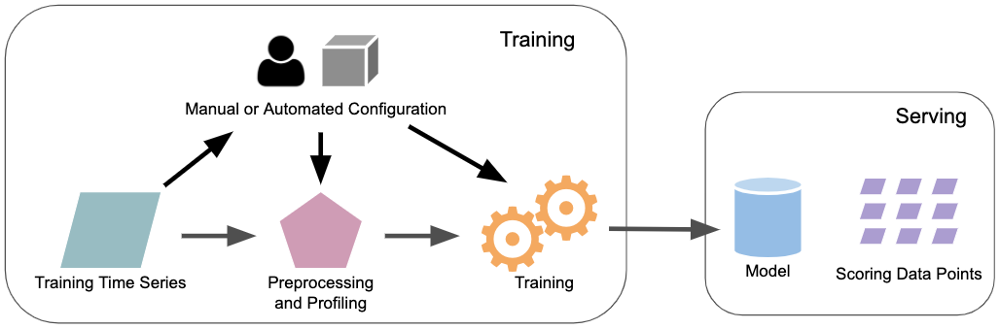

<!-- Logo & Title -->
<p align="center">
</p>
<h3 align="center">A hands-off Anomaly Detection Library</h3>

<!-- Badges Start-->
[](https://badge.fury.io/py/luminaire)
[](https://pypi.org/project/luminaire/)
[](https://github.com/zillow/luminaire/blob/master/LICENSE.txt)
[](https://github.com/zillow/luminaire/actions?query=workflow%3A%22Luminaire+CI%22)
[](https://github.com/zillow/luminaire/actions?query=workflow%3A%22Luminaire+CD%22)
[](https://github.com/zillow/luminaire/actions?query=workflow%3A%22Luminaire+Docs%22)
<!-- Badges End -->

---
**Table of contents**

- [What is Luminaire](#what-is-luminaire)
- [Quick Start](#quick-start)
- [Time Series Outlier Detection Workflow](#time-series-outlier-detection-workflow)
- [Anomaly Detection for High Frequency Time Series](#anomaly-detection-for-high-frequency-time-series)
- [Contributing](#contributing)
- [Acknowledgements](#acknowledgements)
- [Development Team](#development-team)


## What is Luminaire

[Luminaire](https://zillow.github.io/luminaire/) is a python package that provides ML-driven solutions for monitoring time series data. Luminaire provides several anomaly detection and forecasting capabilities that incorporate correlational and seasonal patterns as well as uncontrollable variations in the data over time.

## Quick Start

Install Luminaire from [PyPI](https://pypi.org/project/luminaire/) using ``pip``

```bash
pip install luminaire
```

Import ``luminaire`` module in python 
```python
import luminaire
```

See [Examples](#Examples) to get started. Also, refer to the [Luminaire documentation](https://zillow.github.io/luminaire) for detailed description of methods and usage.


## Time Series Outlier Detection Workflow


Luminaire outlier detection workflow can be divided into 3 major components:

### Data Preprocessing and Profiling Component

This component can be called to prepare a time series prior to training an anomaly detection model on it. This step applies a number of methods that make anomaly detection more accurate and reliable, including missing data imputation, identifying and removing recent outliers from training data, necessary mathematical transformations, and data truncation based on recent change points. It also generates profiling information (historical change points, trend changes, etc.) that are considered in the training process. 

Profiling information for time series data can be used to monitor data drift and irregular long-term swings.

### Modeling Component

This component performs time series model training based on the user-specified configuration OR optimized configuration (see Luminaire hyperparameter optimization). Luminaire model training is integrated with different structural time series models as well as filtering based models. See [Luminaire outlier detection](https://zillow.github.io/luminaire/tutorial/outlier_batch.html) for more information.
 
The Luminaire modeling step can be called after the data preprocessing and profiling step to perform necessary data preparation before training.
 
### Configuration Optimization Component
 
Luminaire's integration with configuration optimization enables a hands-off anomaly detection process where
the user needs to provide very minimal configuration for monitoring any type of time series data. This step can be combined with the preprocessing and modeling for any auto-configured anomaly detection use case. See [fully automatic outlier detection](https://zillow.github.io/luminaire/tutorial/optimization.html#fully-automatic-outlier-detection) for a detailed walkthrough. 

## Anomaly Detection for High Frequency Time Series

Luminaire can also monitor a set of data points over windows of time instead of tracking individual data points. This approach is well-suited for streaming use cases where sustained fluctuations are of greater concern than individual fluctuations. See [anomaly detection for streaming data](https://zillow.github.io/luminaire/tutorial/streaming.html) for detailed information.

## Examples

### Batch Time Series Monitoring
```python
import pandas as pd
from luminaire.optimization.hyperparameter_optimization import HyperparameterOptimization
from luminaire.exploration.data_exploration import DataExploration

data = pd.read_csv('Path to input time series data')
# Input data should have a time column set as the index column of the dataframe and a value column named as 'raw'

# Optimization
hopt_obj = HyperparameterOptimization(freq='D')
opt_config = hopt_obj.run(data=data)

# Profiling
de_obj = DataExploration(freq='D', **opt_config)
training_data, pre_prc = de_obj.profile(data)

# Identify Model
model_class_name = opt_config['LuminaireModel']
module = __import__('luminaire.model', fromlist=[''])
model_class = getattr(module, model_class_name)

# Training
model_object = model_class(hyper_params=opt_config, freq='D')
success, model_date, trained_model = model_object.train(data=training_data, **pre_prc)

# Scoring
trained_model.score(100, '2021-01-01')
```

### Streaming Time Series Monitoring
```python
import pandas as pd
from luminaire.model.window_density import WindowDensityHyperParams, WindowDensityModel
from luminaire.exploration.data_exploration import DataExploration

data = pd.read_csv('Path to input time series data')
# Input data should have a time column set as the index column of the dataframe and a value column named as 'raw'

# Configuration Specs and Profiling
config = WindowDensityHyperParams().params
de_obj = DataExploration(**config)
data, pre_prc = de_obj.stream_profile(df=data)
config.update(pre_prc)

# Training
wdm_obj = WindowDensityModel(hyper_params=config)
success, training_end, model = wdm_obj.train(data=data)

# Scoring
score, scored_window = model.score(scoring_data)    # scoring_data is data over a time-window instead of a datapoint
```

## Contributing

Want to help improve Luminaire? Check out our [contributing documentation](CONTRIBUTING.rst).

## Citing

Please cite the following article if Luminaire is used for any research purpose or scientific publication:

*Chakraborty, S., Shah, S., Soltani, K., Swigart, A., Yang, L., & Buckingham, K. (2020, December). Building an 
Automated and Self-Aware Anomaly Detection System. In 2020 IEEE International Conference on Big Data (Big Data) 
(pp. 1465-1475). IEEE.* ([arxiv link](https://arxiv.org/abs/2011.05047))

## Other Useful Resources

- *Chakraborty, S., Shah, S., Soltani, K., & Swigart, A. (2019, December). Root Cause Detection Among Anomalous Time 
Series Using Temporal State Alignment. In 2019 18th IEEE International Conference On Machine Learning And Applications 
(ICMLA) (pp. 523-528). IEEE.* ([arxiv link](https://arxiv.org/abs/2001.01056))


## Blogs

- Zillow Tech Hub: [*Automatic and Self-aware Anomaly Detection at Zillow Using Luminaire*](https://medium.com/zillow-tech-hub/automatic-and-self-aware-anomaly-detection-at-zillow-using-luminaire-7addfdae4ca9)


## Development Team

Luminaire is developed and maintained by [Sayan Chakraborty](https://github.com/sayanchk), [Smit Shah](https://github.com/shahsmit14), [Kiumars Soltani](https://github.com/kiumarss), [Luyao Yang]( https://github.com/snazzyfox), [Anna Swigart](https://github.com/annaswigart), [Kyle Buckingham](https://github.com/kylebuckingham) and many other contributors from the Zillow Group A.I. team.
