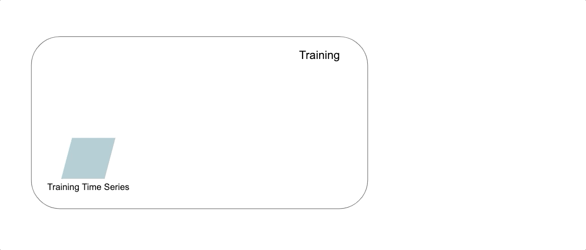

# Luminaire: A hands-off Anomaly Detection Library

<!-- Badges Start-->
[](https://badge.fury.io/py/luminaire)
[](https://pypi.org/project/luminaire/)
[](https://github.com/zillow/luminaire/blob/master/LICENSE.txt)
[](https://github.com/zillow/luminaire/actions?query=workflow%3A%22Luminaire+CI%22)
[](https://github.com/zillow/luminaire/actions?query=workflow%3A%22Luminaire+CD%22)
<!-- Badges End -->


**Table of contents**

- [What is Luminaire](#what-is-luminaire)
- [Quick Start](#quick-start)
- [Time Series Outlier Detection Workflow](#time-series-outlier-detection-workflow)
- [Anomaly Detection for High Frequency Time Series](#anomaly-detection-for-high-frequency-time-series)
- [Contributing](#contributing)
- [Acknowledgements](#acknowledgements)
- [Development Team](#development-team)


## What is Luminaire

[Luminaire](https://zillow.github.io/luminaire/luminaire/docs_source/_build/html/Introduction.html) is a python package 
that provides ML-driven solutions for monitoring time series data. Luminaire provides several anomaly detection and 
forecasting capabilities that incorporate correlational and seasonal patterns as well as uncontrollable variations in 
the data over time.

## Quick Start

Install Luminaire from [PyPI](https://pypi.org/project/luminaire/) using ``pip``

```bash
pip install luminaire
```

Import ``luminaire`` module in python 
```python
import luminaire
```

Check out [Luminaire documentation](https://zillow.github.io/luminaire/luminaire/docs_source/_build/html/Introduction.html) 
for detailed description of methods and usage.


## Time Series Outlier Detection Workflow


Luminaire outlier detection workflow can be divided into 3 major components:

### Data Preprocessing and Profiling Component

This component can be called to prepare a time series prior to training an anomaly detection model on it. This step applies
a number of methods that make anomaly detection more accurate and reliable, including missing data imputation, identifying and removing recent outliers from training data, necessary mathematical transformations, and data truncation based on recent change points. It also generates profiling 
information (historical change points, trend changes, etc.) that are considered in the training process. 

Profiling information for time series data can be used to monitor data drift and irregular long-term swings.

### Modeling Component

This component performs time series model training based on the user-specified configuration OR optimized configuration 
(see Luminaire hyperparameter optimization). Luminaire model training is integrated with different structural time series
models as well as filtering based models. See [Luminaire outlier detection](https://zillow.github.io/luminaire/luminaire/docs_source/_build/html/basic_usage_tutorial/outlier_batch.html)
for more information.
 
The Luminaire modeling step can be called after the data preprocessing and profiling step to perform necessary data preparation before training.
 
### Configuration Optimization Component
 
Luminaire's integration with configuration optimization enables a hands-off anomaly detection process where
the user needs to provide very minimal configuration for monitoring any type of time series data. This step can be combined with
the preprocessing and modeling for any auto-configured anomaly detection use case. See [fully automatic outlier detection](https://zillow.github.io/luminaire/luminaire/docs_source/_build/html/basic_usage_tutorial/optimization.html#fully-automatic-outlier-detection)
for a detailed walkthrough. 


## Anomaly Detection for High Frequency Time Series

Luminaire can also monitor a set of data points over windows of time instead of tracking individual data points. This approach is well-suited
for streaming use cases where sustained fluctuations are of greater concern than individual fluctuations. See [anomaly detection for streaming data](https://zillow.github.io/luminaire/luminaire/docs_source/_build/html/basic_usage_tutorial/streaming.html) for detailed information.


## Contributing

Want to help improve Luminaire? Check out our [contributing documentation](luminaire/docs_source/CONTRIBUTING.rst).


## Acknowledgements

This project has leveraged methods described in the following scientific publications:

1. Soule, Augustin, Kavé Salamatian, and Nina Taft. "Combining filtering and statistical methods for anomaly detection." Proceedings of the 5th ACM SIGCOMM conference on Internet Measurement. 2005.


## Development Team

Luminaire is developed and maintained by [Sayan Chakraborty](https://github.com/sayanchk), [Smit Shah](https://github.com/shahsmit14), 
[Kiumars Soltani](https://github.com/kiumarss), [Luyao Yang]( https://github.com/snazzyfox), [Anna Swigart](https://github.com/annaswigart), 
[Kyle Buckingham](https://github.com/kylebuckingham) and many other contributors from the Zillow Group A.I. team.
