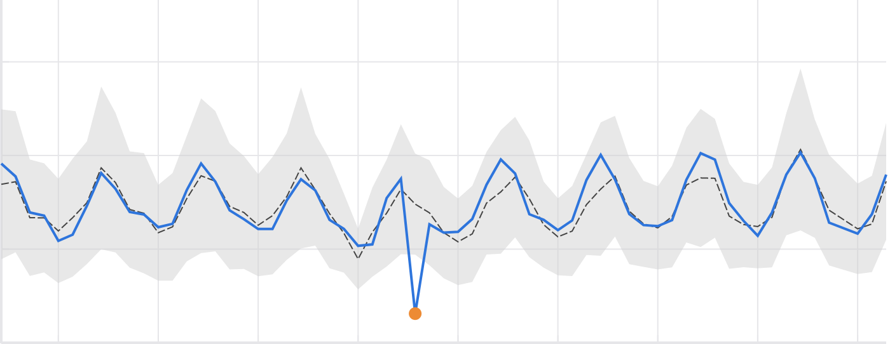

Introduction
============

Luminaire is a python package that provides ML driven solutions for monitoring time series data. Luminaire provides several anomaly detection and forecasting capabilities that incorporate correlational and seasonal patterns in the data over time as well as uncontrollable variations. Specifically, Luminaire is equipped with the following key features:

- **Generic Anomaly Detection:** Luminaire is a generic anomaly detection tool containing several classes of time series models focused toward catching any irregular fluctuations over different kinds of time series data.

- **Fully Automatic:** Luminaire performs optimizations over different sets of hyperparameters and several model classes to pick the optimal model for the time series under consideration. No model configuration is required from the user.

- **Supports Diverse Anomaly Detection Types:** Luminaire supports different detection types:

  + Outlier Detection
  + Data Shift Detection
  + Trend Change Detection
  + Null Data Detection
  + Density comparison for streaming data

Data Exploration and Profiling
-----------------------------------
Luminaire performs exploratory profiling on the data before progressing to optimization and training. This step provides batch insights about the raw training data on a given time window and also enables automated decisions regarding data pre-processing during the optimization process. These tests and pre-processing steps include:

- Checking for recent data shifts
- Detecting recent trend changes
- Stationarity adjustments
- Imputation of missing data

Outlier Detection
-----------------------
Luminaire generates a model for a given time series based on its recent patterns. Luminaire implements several modeling techniques to learn different variational patterns of the data that ranges from ARIMA, Filtering Models, and Fourier Transform. Luminaire incorporates the global characteristics while learning the local patterns in order to make the learning process robust to any local fluctuations and for faster execution.

Configuration Optimization for Outlier Detection Models
-------------------------------------------------------------
Luminaire combines many techniques under hood to find the optimal model for every time series. `Hyperopt <http://hyperopt.github.io/hyperopt/>`_ is used at its core to optimize over the global hyperparameters for a given time series. In addition, Luminaire identifies whether a time series shows exponential characteristics in terms of its variational patterns, whether holidays have any effects on the time series, and whether the time series shows a long term correlational or Markovian pattern (depending on the last value only).

Anomaly Detection for Streaming Data
------------------------------------
Luminaire performs anomaly detection over streaming data by comparing the volume density of the incoming data stream with a preset baseline time series window. Luminaire is capable of tracking time series windows over different data frequencies and is autoconfigured to support most typical streaming use cases.

Citing
------
Please cite the following article if Luminaire is used for any research purpose or scientific publication:

*Chakraborty, S., Shah, S., Soltani, K., Swigart, A., Yang, L., & Buckingham, K. (2020). Building an Automated and Self-Aware Anomaly Detection System. arXiv preprint arXiv:2011.05047.* (`arxiv_link`_)

.. _arxiv_link: https://arxiv.org/abs/2011.05047
