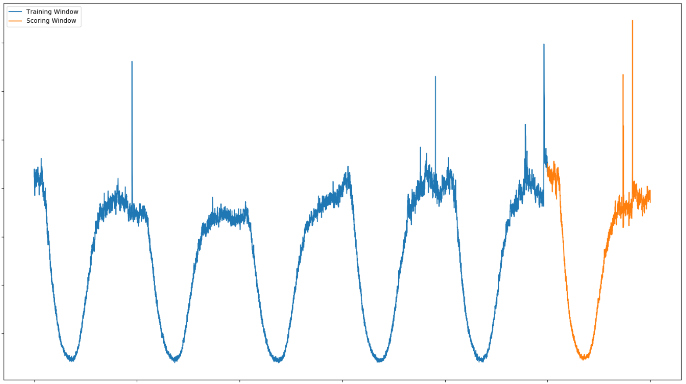

Anomaly Detection for Streaming data
====================================

Luminaire *WindowDensityModel* implements the idea of monitoring data over comparable windows instead of tracking individual data points as outliers. This is a useful approach for tracking anomalies over high frequency data, which tends to show a higher level of noise. Hence, tracking anomalies over streaming data essesntially means tracking sustained fluctuations.

Although *WindowDensityModel* is designed to track anomalies over streaming data, it can be used to track anomalies even for low frequency time series. This detection type is suggested for up to hourly data frequency.

This window based anomaly detection feature in Luminaire operates fully automatically where the underlying model detects the frequency that the data has been observed, the optimal size of the window (using the periodic signals in the data) and the optimal detection method given some identified characteristics from the input time series. Moreover, user also has the ability to overwright the configuration for custom use cases.

Fully Automated Anomaly Detection using Time-windows
----------------------------------------------------

Luminaire provides a fully automated anomaly detection method that tracks time series abnormalities over time-windows. Luminaire is capable of selecting the best possible setting by studying different characteristics of the input time series. Although, compared to the Luminaire outlier detection module, the window based anomaly detection does not require running any separate configuration optimization to obtain the best hyperparameters. Rather, the automation process is embedded withing the data exploration and the training process.

Similar to the outlier detection module, Luminaire Window Density Model comes with a streaming data profiling module to extract different characteristics about the high-frequency time series.

>>> from luminaire.model.window_density import WindowDensityHyperParams, WindowDensityModel
>>> from luminaire.exploration.data_exploration import DataExploration
>>> print(data)
                        raw
index
2020-06-04 00:00:00  227798
2020-06-04 00:10:00  224593
2020-06-04 00:20:00  229400
2020-06-04 00:30:00  217813
2020-06-04 00:40:00  217862
...                     ...
2020-07-02 23:20:00  221226
2020-07-02 23:30:00  218762
2020-07-02 23:40:00  225726
2020-07-02 23:50:00  220783
2020-07-03 00:00:00  260981

>>> config = WindowDensityHyperParams().params
>>> de_obj = DataExploration(**config)
>>> data, pre_prc = de_obj.stream_profile(df=data)
print(data, pre_prc)
                        raw  interpolated
2020-06-04 00:10:00  224593      224593.0
2020-06-04 00:20:00  229400      229400.0
2020-06-04 00:30:00  217813      217813.0
2020-06-04 00:40:00  217862      217862.0
2020-06-04 00:50:00  226861      226861.0
...                     ...           ...
2020-07-02 23:20:00  221226      221226.0
2020-07-02 23:30:00  218762      218762.0
2020-07-02 23:40:00  225726      225726.0
2020-07-02 23:50:00  220783      220783.0
2020-07-03 00:00:00  260981      260981.0
[4176 rows x 2 columns]
{'success': True, 'freq': '0 days 00:10:00', 'window_length': 144, 'min_window_length': 10, 'max_window_length': 100000}

Luminaire *stream_profile* performs missing data imputation if necessary, extracts the frequency information and obtains the optimal size of the window to be monitored (if not specified by the user). All the information obtained by the profiler can be used to update the configuration for the actual training process.

>>> config.update(pre_prc)
>>> wdm_obj = WindowDensityModel(hyper_params=config)
>>> success, training_end, model = wdm_obj.train(data=data)
>>> print(success, training_end, model)
True 2020-07-03 00:00:00 <luminaire.model.window_density.WindowDensityModel object at 0x7fb6fab80b00>

The training process generates the success flag, the model timestamp and the actual trained model. The trained model here is a collection of several sub-models that can be used to score any equal length time segment of the day and does not depend on the specific patterns based on the selected time window.
In order to score a new window innovation given the trained model object, we have to provide a equal sized time window. Moreover, Luminaire allows the user to perform basic processing (imputing missing index etc.) of the scoring window in order to get the data ready for scoring.

>>> print(scoring_data)
                        raw
index
2020-07-03 00:00:00  260981
2020-07-03 00:10:00  274249
2020-07-03 00:20:00  293194
2020-07-03 00:30:00  272722
2020-07-03 00:40:00  276930
...                     ...
2020-07-03 23:10:00  287773
2020-07-03 23:20:00  255438
2020-07-03 23:30:00  277127
2020-07-03 23:40:00  266263
2020-07-03 23:50:00  275432
>>> freq = model._params['freq']
>>> de_obj = DataExploration(freq=freq)
>>> processed_data, pre_prc = de_obj.stream_profile(df=scoring_data, impute_only=True, impute_zero=True)

The processed data can be used to score as:

>>> score, scored_window = model.score(processed_data)
>>> print(score)
{'Success': True, 'ConfLevel': 99.9, 'IsAnomaly': True, 'AnomalyProbability': 1.0}

User can also score rolling (or overlapping windows) windows instead of sequential windows for more frequent anomaly detection use cases.

>>> print(scoring_data)
                        raw
index
2020-07-02 12:10:00  203836
2020-07-02 12:20:00  209813
2020-07-02 12:30:00  206271
2020-07-02 12:40:00  209135
2020-07-02 12:50:00  207085
...                     ...
2020-07-03 11:20:00  255009
2020-07-03 11:30:00  260246
2020-07-03 11:40:00  248541
2020-07-03 11:50:00  246094
2020-07-03 12:00:00  252223
>>> freq = model._params['freq']
>>> de_obj = DataExploration(freq=freq)
>>> processed_data, pre_prc = de_obj.stream_profile(df=scoring_data, impute_only=True, impute_zero=True)
>>> score, scored_window = model.score(processed_data)
>>> print(score)
'Success': True, 'ConfLevel': 99.9, 'IsAnomaly': True, 'AnomalyProbability': 0.9999867236}

Reusing Past Trained Model
^^^^^^^^^^^^^^^^^^^^^^^^^^

Luminaire Window Density model also comes with the capability of ingesting previously trained model in the future model trainings. This can be part of a sequential process that always passes the last trained model in the next training. This ensures richer data accumulation to have more reliable scores, specially when the training history is limited to a fixed length rolling window. This way, the model is able to keep larger history as a metadata even though the actual training history is limited.

>>> past_model = <luminaire.model.window_density.WindowDensityModel object at 0x7fb6fab80b00>
>>> print(new_training_data)
                        raw
index
2020-06-04 00:00:00  227798
2020-06-04 00:10:00  224593
2020-06-04 00:20:00  229400
2020-06-04 00:30:00  217813
2020-06-04 00:40:00  217862
...                     ...
2020-07-03 23:10:00  287773
2020-07-03 23:20:00  255438
2020-07-03 23:30:00  277127
2020-07-03 23:40:00  266263
2020-07-03 23:50:00  275432
>>> success, training_end, model = wdm_obj.train(data=new_training_data, past_model=past_model)

Anomaly Detection using Time-windows: Manual Configuration
----------------------------------------------------------

There are several options in the *WindowDensityHyperParams* class that can be manually configured. User can select different option starting from the desired window size, whether all previous windows should be used to identify anomalies or the last window only, the detection method and how to manage nonstationarity and periodicity present in the data and so on. Please refer to the API reference for `Streaming Anomaly Detection Models <https://zillow.github.io/luminaire/api_reference/streaming.html>`_.

>>> from luminaire.model.window_density import WindowDensityHyperParams, WindowDensityModel
>>> print(data)
                        raw
index
2020-06-04 00:00:00  227798
2020-06-04 00:10:00  224593
2020-06-04 00:20:00  229400
2020-06-04 00:30:00  217813
2020-06-04 00:40:00  217862
...                     ...
2020-07-02 23:20:00  221226
2020-07-02 23:30:00  218762
2020-07-02 23:40:00  225726
2020-07-02 23:50:00  220783
2020-07-03 00:00:00  218315
>>>config = WindowDensityHyperParams(freq='10T',
                                     detection_method='kldiv',
                                     baseline_type="last_window",
                                     window_length=6*6,
                                     detrend_method='modeling'
                                     ).params
>>> de_obj = DataExploration(**config)
>>> data, pre_prc = de_obj.stream_profile(df=data)
>>> print(data, pre_prc)
                        raw  interpolated
2020-06-05 00:10:00  227504      227504.0
2020-06-05 00:20:00  225664      225664.0
2020-06-05 00:30:00  227586      227586.0
2020-06-05 00:40:00  223805      223805.0
2020-06-05 00:50:00  222679      222679.0
...                     ...           ...
2020-07-02 23:20:00  221226      221226.0
2020-07-02 23:30:00  218762      218762.0
2020-07-02 23:40:00  225726      225726.0
2020-07-02 23:50:00  220783      220783.0
2020-07-03 00:00:00  218315      218315.0
[4032 rows x 2 columns]
{'success': True, 'freq': '10T', 'window_length': 36, 'min_window_length': 10, 'max_window_length': 100000}
>>> config.update(pre_prc)
>>> wdm_obj = WindowDensityModel(hyper_params=config)
>>> success, training_end, model = wdm_obj.train(data=data)
>>> print(success, training_end, model)
True 2020-07-03 00:00:00 <luminaire.model.window_density.WindowDensityModel object at 0x7ff33ef74550>

The trained model object can be used to score the data of a similar window size.

>>> print(data)
                        raw
index
2020-07-03 06:10:00  222985
2020-07-03 06:20:00  210951
2020-07-03 06:30:00  210094
2020-07-03 06:40:00  215166
2020-07-03 06:50:00  212968
...                     ...
2020-07-03 11:20:00  209008
2020-07-03 11:30:00  211170
2020-07-03 11:40:00  203302
2020-07-03 11:50:00  204498
2020-07-03 12:00:00  203234
>>> freq = model._params['freq']
>>> de_obj = DataExploration(freq=freq)
>>> processed_data, pre_prc = de_obj.stream_profile(df=data, impute_only=True, impute_zero=True)
>>> score, scored_window = model.score(processed_data)
>>> print(score)
{'Success': True, 'ConfLevel': 99.9, 'IsAnomaly': False, 'AnomalyProbability': 0.330817121756509}

