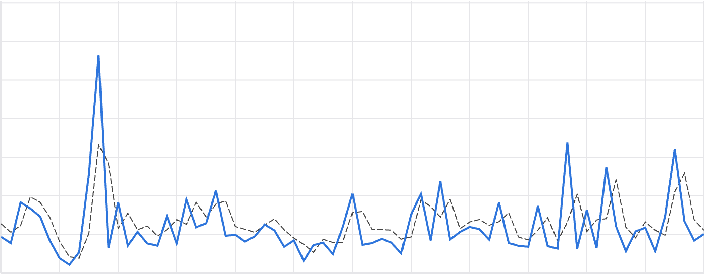
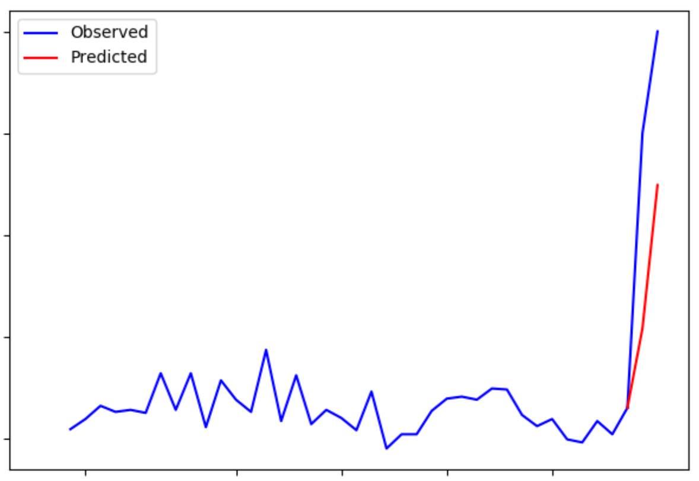

Outlier Detection
========

Luminaire can detect outliers in time series data by modeling the predictive and the variational patterns of a time series trajectory. Luminaire is capable of tracking outliers for any time series data by applying two specific modeling capabilities:

- **Structural Model**: This technique is suitable for time series datasets that show periodic patterns and contains good predictive signals through temporal correlations.
- **Filtering Model**: This technique is suitable for noisy time series datasets that contains almost no predictive signals from the periodic or temporal correlation signals.

Anomaly Detection using Structural Model
----------------------------------------

.. image:: structural.png

Luminaire provides the full capability to have user-specified configuration for structural modeling. Under the hood, Luminaire implements a linear or an exponential model allowing multiple user specified auto regressive and moving average components to track any temporal correlational patterns. Fourier transformation can also be applied under the hood if the data shows strong seasonality or periodic patterns. As external structural information, Luminaire allows holidays to be added as external exogenous features (currently supported for daily data only) inside the structural model.

>>> hyper_params = {"include_holidays_exog": True, "is_log_transformed": False, "max_ft_freq": 5, "p": 3, "q": 3}
>>> lad_struct_obj = LADStructuralModel(hyper_params=hyper, freq='D')
>>> print(lad_struct_obj)
<luminaire_models.model.lad_structural.LADStructuralModel object at 0x7fc91882bb38>

Luminaire allows some data-specific information to be added during the training process of the structural model through *preprocessing_parameters*. The *preprocessing_parameters* can either be specified by the user if the data-specific information is available through external sources OR can be obtained using *Luminaire DataExploration*. The data-specific information includes a list of trend changes, change points (data shifts), and start and end of the input time series.

>>> de_obj = DataExploration(freq='D', data_shift_truncate=False, is_log_transformed=True, fill_rate=0.9)
>>> data, pre_prc = de_obj.profile(data)
>>> print(pre_prc)
{'success': True, 'trend_change_list': ['2020-04-01 00:00:00'], 'change_point_list': ['2020-03-16 00:00:00'], 
'is_log_transformed': 1, 'min_ts_mean': None, 'ts_start': '2020-01-01 00:00:00', 'ts_end': '2020-06-07 00:00:00'}

These *preprocessing_parameters* are used for training the structural model.

>>> success, model_date, model = lad_struct_obj.train(data=data, **pre_prc)
>>> print(success, model_date, model)
(True, '2020-06-07 00:00:00', <luminaire_models.model.lad_structural.LADStructuralModel object at 0x7f97e127d320>)

The trained model works as a data-driven source of truth to evaluate any future time series values to be monitored. The *score* method is used to check whether new data points are anomalous.

>>> model.score(2000, '2020-06-08')
{'Success': True, 'IsLogTransformed': 1, 'LogTransformedAdjustedActual': 7.601402334583733, 'LogTransformedPrediction': 7.85697078664991, 'LogTransformedStdErr': 0.05909378128162875, 'LogTransformedCILower': 7.759770166178546, 'LogTransformedCIUpper': 7.954171407121274, 'AdjustedActual': 2000.000000000015, 'Prediction': 1913.333800801316, 'StdErr': 111.1165409184448, 'CILower': 1722.81265596681, 'CIUpper': 2093.854945635823, 'ConfLevel': 90.0, 'ExogenousHolidays': 0, 'IsAnomaly': False, 'IsAnomalyExtreme': False, 'AnomalyProbability': 0.5616869199903785, 'DownAnomalyProbability': 0.21915654000481077, 'UpAnomalyProbability': 0.7808434599951892, 'ModelFreshness': 0.1}
>>> model.score(2500, '2020-06-09')
{'Success': True, 'IsLogTransformed': 1, 'LogTransformedAdjustedActual': 7.824445930877619, 'LogTransformedPrediction': 7.879245788204654, 'LogTransformedStdErr': 0.060630109233816995, 'LogTransformedCILower': 7.779518133128947, 'LogTransformedCIUpper': 7.978973443280362, 'AdjustedActual': 2500.000000000004, 'Prediction': 1955.906824510712, 'StdErr': 116.8279277089905, 'CILower': 1763.74860305128, 'CIUpper': 2158.065045970143, 'ConfLevel': 90.0, 'ExogenousHolidays': 0, 'IsAnomaly': True, 'IsAnomalyExtreme': True, 'AnomalyProbability': 0.9999955054511667, 'DownAnomalyProbability': 2.2472744166668335e-06, 'UpAnomalyProbability': 0.9999977527255833, 'ModelFreshness': 0.2}

.. image:: struct_score.png
    :scale: 55%

The scoring function outputs several fields. The key to identifying whether a data point has been detected as an anomaly is the *AnomalyProbability* field (for anomalous fluctuations in either direction) and *DownAnomalyProbability*, *UpAnomalyProbability* for one-sided fluctuations that are lower or higher than expected, respectively. The user can set any anomaly threshold to identify whether a pont is an anomaly or not. From the above example, by setting the anomaly threshold at *0.99* for both sided fluctuations, we can see the the the value corresponding to *2020-06-08* is non anomalous whereas the value for *2020-06-09* is anomalous. Luminaire also has its own pre-specified thresholds at *0.9* and at *0.999* for identifying mild an extreme anomalies (see the keys *IsAnomaly* and *IsAnomalyExtreme*).

Luminaire generates a *ModelFreshness* score to identify how fresh the model is (i.e. what is the difference between the scoring data date and the model date). This freshness scores varies between 0 to 1 and the model object expires whenever the freshness score exceeds the value 1.

Forecasting
^^^^^^^^^^^

Since the anomaly detection process through structural modeling depends on quantifying the predictive and the variational patterns of the underlying data, Luminaire also outputs several forecasting metrics such as *Prediction*, *StdErr*, *CILower* and *CIUpper* that can be used for time series forecasting use cases.

.. Note :: The *ConfLevel* in the scoring output corresponds to the generated confidence intervals and to the *IsAnomaly* flag

Anomaly Detection using Filtering Model
----------------------------------------

Luminaire allows monitoring noisy and not too well behaved time series data by tracking the residual process from a filtering model. This model should not be used for predictive purposes but can be used to measure variational patterns and irregular fluctuations.

Filtering requires very minimal specification in terms of configurations. The user needs to only configure whether to implement a linear or exponential model.

>>> hyper = {"is_log_transformed": 1}
>>> lad_filter_obj = LADFilteringModel(hyper_params=hyper, freq='D')
>>> print(lad_filter_obj)
<luminaire_models.model.lad_filtering.LADFilteringModel object at 0x7fd2b1832dd8>

Similar to the structural model, the user can specify the *preprocessing_parameters* (see lad structural modeling tutorial for further information). These *preprocessing_parameters* are required to train the Luminaire filtering model.

>>> success, model_date, model = lad_filter_obj.train(data=data, **pre_prc)
>>> print(success, model_date, model)
(True, '2019-08-27 00:00:00', <luminaire_models.model.lad_filtering.LADFilteringModel object at 0x7fd2aef00278>)

Similar to the structural model, this trained filtering model can be used to score any future time series values. Moreover, the filtering model updates some components of the model object every time it scores to keep the variational information updated.

>>> scores, model_update = model.score(400, '2019-08-28')
>>> print(scores, model_update)
({'Success': True, 'AdjustedActual': 1.4535283491638031, 'ConfLevel': 90.0, 'Prediction': 208.36315843605394, 'PredStdErr': 41.36628211756695, 'IsAnomaly': True, 'IsAnomalyExtreme': False, 'AnomalyProbability': 0.9875848462383774, 'DownAnomalyProbability': 0.006207576880811305, 'UpAnomalyProbability': 0.9937924231191887, 'NonStationarityDiffOrder': 1, 'ModelFreshness': 0.1}, <luminaire_models.model.lad_filtering.LADFilteringModel object at 0x7fd2b20a65c0>)

The trained *model* can only be used to score the next innovation after the training. To score any futher points in the future, the iterative *model_update* needs to be used.

>>> scores_2, model_update_2 = model_update.score(500, '2019-08-29')
>>> print(scores_2, model_update_2)
({'Success': True, 'AdjustedActual': -0.591849553174421, 'ConfLevel': 90.0, 'Prediction': 349.67004799036243, 'PredStdErr': 69.28590609594112, 'IsAnomaly': True, 'IsAnomalyExtreme': True, 'AnomalyProbability': 0.9999663774928771, 'DownAnomalyProbability': 0.9999831887464385, 'UpAnomalyProbability': 1.681125356141111e-05, 'NonStationarityDiffOrder': 1, 'ModelFreshness': 0.2}, <luminaire_models.model.lad_filtering.LADFilteringModel object at 0x7fd2b1c81e48>)

.. Note :: Prediction for the filtering model is a posterior prediction, which means the prediction is made after observing the data to score. See `kalman_filter`_ for more information.

.. Note :: It is important to note that the model update process during scoring only updates a small portion of the model component. It is a good practice to train the model over some schedule to acheive the best performance.

.. _kalman_filter: https://en.wikipedia.org/wiki/Kalman_filter#Predict

